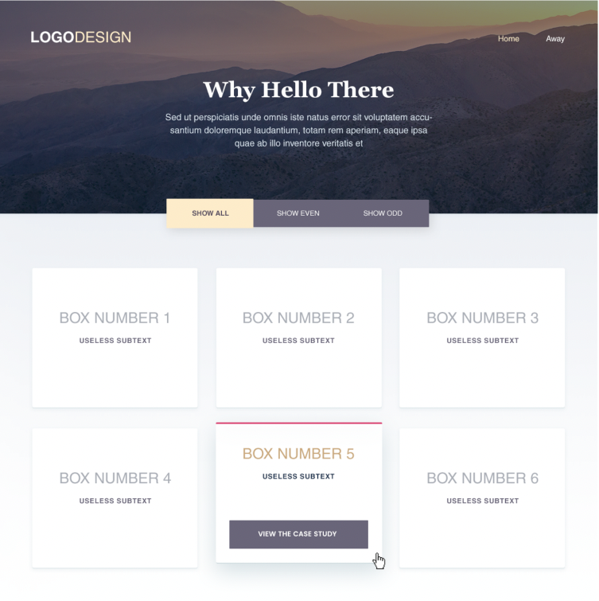

# Bonfire Studios Coding Challenge

## View the [Deployed App](https://mitchgemma.github.io/Bonfire-Studios-Challenge/#)

## Objective

Take the attached Photoshop document and turn it into a single working web page. You can build in any way that you want using HTML, JS, CSS with a few exceptions:

- Do not use front end frameworks for JS (ex. react, vue, etc).
- Do not use Bootstrap or similar css libraries
- Use Sass to write css
- Use Github to manage the project

## Requirements

- The final page should work across all screen sizes from a full width desktop down to mobile
- The final page should work across modern versions of Chrome, Firefox, Safari, and Edge.
- The tabs that say “all”, “even”, and “odd” should show/hide the appropriate boxes below. It should start off with “all” selected and all boxes showing.
- We’ve included an example of what the boxes should look like when the user hovers over one.

## Technologies Used:

- HTML
- Sass
- JavaScript

## Sample Photo

